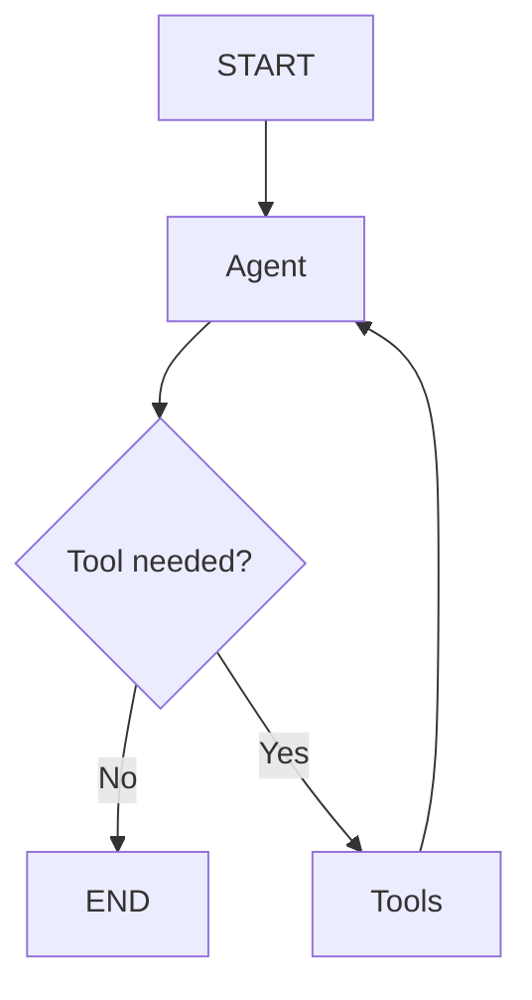

# Rutgers AI Agent Workshop

Build a useful Rutgers Campus Assistant by adding tools to a working LangGraph
agent. The graph, chat interface, streaming API, tool routing, result cards, and
activity log are already built. Your job is to give the agent new capabilities.

Each checkpoint adds a harder ability. The agent starts useful (course lookup)
and gets better as you go.

## What you will build

By the end, your agent can combine course, dining, building, event, and grade
tools to solve a practical student request:

```text
I'm studying for CS112 tomorrow and want food afterward on Busch.
Find CS112 info, calculate my GPA for A, B+, and B, and find dining nearby.
```

The model chooses tools; LangGraph runs them; the interface shows each step:



## 1. Run the starter

You need Node.js 20 or newer and a free Gemini API key.

1. Get a key from [Google AI Studio](https://aistudio.google.com/apikey).
2. Install and configure the app:

   ```bash
   npm install
   cp .env.example .env.local
   ```

3. Put your key in `.env.local`:

   ```bash
   GOOGLE_API_KEY=your_key_here
   ```

4. Start the app:

   ```bash
   npm run dev
   ```

5. Open [http://localhost:3000](http://localhost:3000) and ask:

   ```text
   What is CS112 and where is it usually taught?
   ```

Watch the **Agent Activity** panel. The agent calls `getCourseInfo`, gets
structured course data, and the UI renders a course card. Then try:

```text
Where can I eat on Busch?
```

Without a dining tool, the agent cannot look that up. That gap is what you
will close next.

If Gemini's free tier is unavailable, add `GROQ_API_KEY` to `.env.local`; the
starter automatically uses the fallback model. Never commit `.env.local`.

## 2. Understand the prebuilt graph

You do not need to build LangGraph today. Read these files in order:

| File | Plain-English purpose |
| --- | --- |
| [`agent/graph.ts`](agent/graph.ts) | How the agent moves |
| [`agent/state.ts`](agent/state.ts) | What the agent remembers |
| [`agent/nodes.ts`](agent/nodes.ts) | What happens at each stop |
| [`agent/tools.ts`](agent/tools.ts) | What the agent can do |
| [`agent/prompts.ts`](agent/prompts.ts) | How the assistant should behave |

The important loop in `graph.ts` is:

```text
START → agent → tools? → agent → END
```

When the model returns a normal message, the graph ends. When it returns a tool
call, `ToolNode` executes that tool and sends its result back to the model.

`getCourseInfo` in [`agent/tools.ts`](agent/tools.ts) is the working example:

- a function performs the work;
- a description tells the model when to use it;
- a Zod schema defines valid arguments;
- the tool returns predictable JSON.

## 3. Add dining (search, return a list)

Open [`agent/tools.ts`](agent/tools.ts) and implement `findDining`.

1. Import `searchDining` from [`data/dining.ts`](data/dining.ts).
2. Call it with `query`.
3. Return `JSON.stringify({ kind: "dining", query, matches })`.
4. Add `findDining` to the exported `tools` array.

Test:

```text
Find a meal-plan dining option on Busch.
```

This is harder than course lookup because the tool searches and can return
several matches.

## 4. Add buildings (nicknames and nearby places)

Implement `findBuilding` using [`data/buildings.ts`](data/buildings.ts).
Students say "Hill" or "CORE", not the official building name. Handle empty
results instead of crashing.

Test:

```text
Where is Hill Center, and what's nearby?
```

## 5. Add events (filter by topic)

Implement `findEvents` using [`data/events.ts`](data/events.ts). Filter by
campus, organization, course, or topic.

Test:

```text
Show me upcoming computer science events.
```

## 6. Add grades, then combine tools

Implement `calculateGrade`: parse comma-separated letter grades, validate them,
map to points, and return a GPA.

Then ask one question that needs several tools:

```text
Tell me about CS112, find dining on its campus, and calculate my GPA for A, B+, B.
```

The activity panel should show multiple graph passes. Tool calls may run in
parallel when the model requests them together.

Keep the input schema flat and give every field a clear `.describe(...)`.
Gemini uses that schema to create the arguments. Return a `kind` field so the
UI can pick a card:

```ts
return JSON.stringify({
  kind: "dining",
  query,
  matches,
});
```

## 7. Create your tool

Design one Rutgers-specific capability. Ideas:

- estimate study time;
- find a quiet study spot;
- build a bus-ready campus itinerary;
- recommend a club from interests;
- calculate meal swipes remaining.

Add data if needed, return structured JSON, register the tool, and update
[`agent/prompts.ts`](agent/prompts.ts) only if the agent needs extra guidance.

### Final challenge

```text
I'm studying for CS112 tomorrow and want food afterward on Busch.
Find CS112 info, calculate my GPA for A, B+, and B, and find dining nearby.
```

A completed agent should call `getCourseInfo`, `calculateGrade`, and
`findDining`, then synthesize one answer.

## Stretch goals

- Add a new result card in [`components`](components).
- Make errors more helpful and test a failed lookup.
- Add tool confirmation before a high-impact action.
- Connect one tool to an external API.
- Improve the system prompt.
- Add persistent memory rather than process-local memory.

## Useful commands

```bash
npm run dev        # start the workshop app
npm run typecheck  # check TypeScript
npm run lint       # run ESLint
npm run build      # verify a production build
```

## Need the completed version?

The student starter is on `main`. Instructors can reveal the finished tools:

```bash
git switch solution
```

Return to your work with `git switch main`. Avoid switching with uncommitted
changes; commit or stash your work first.
